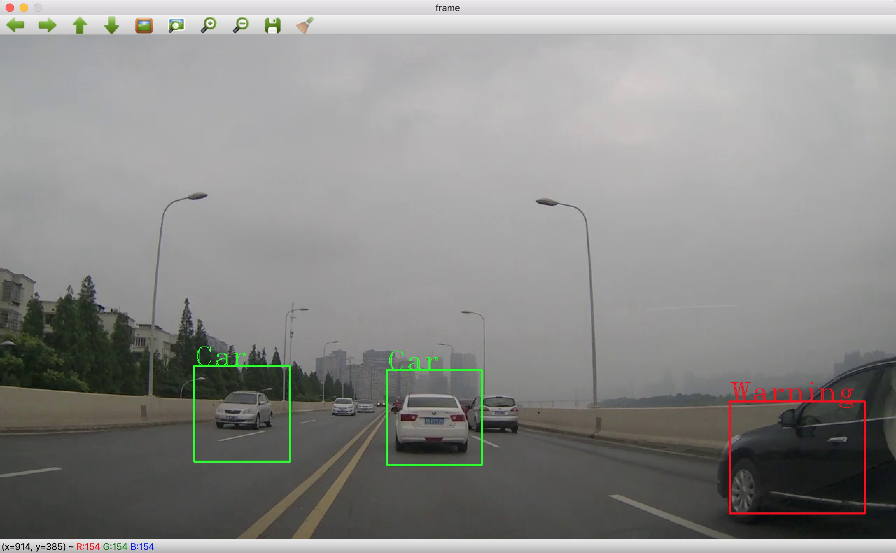
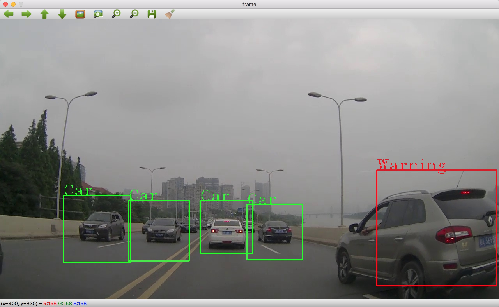
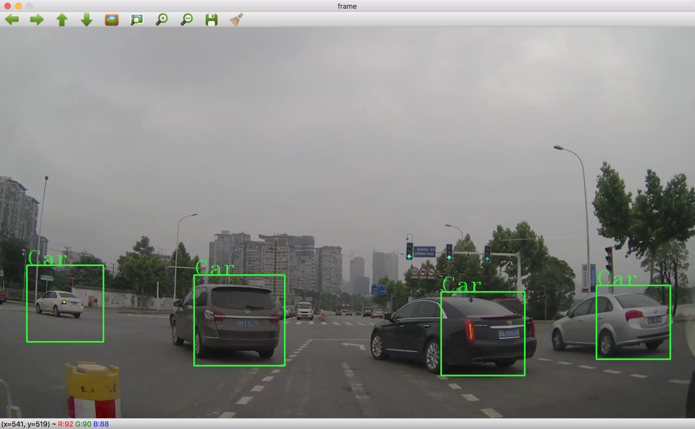
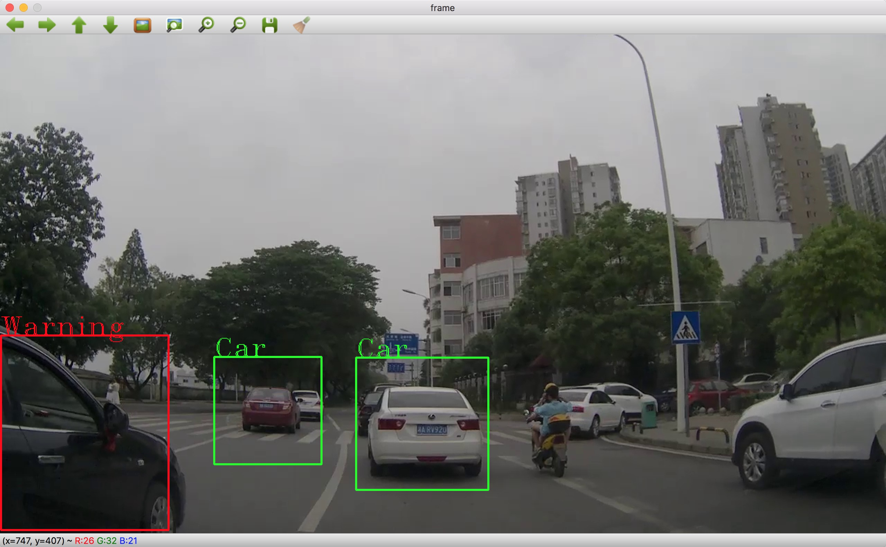
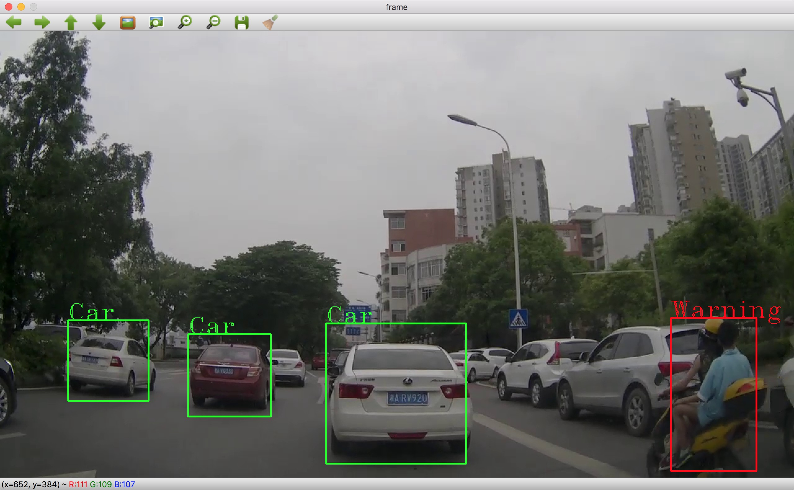
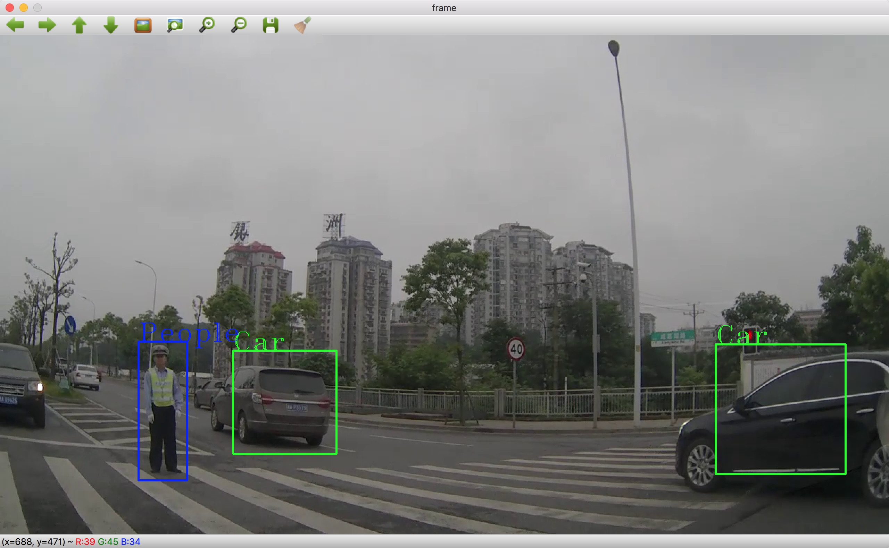
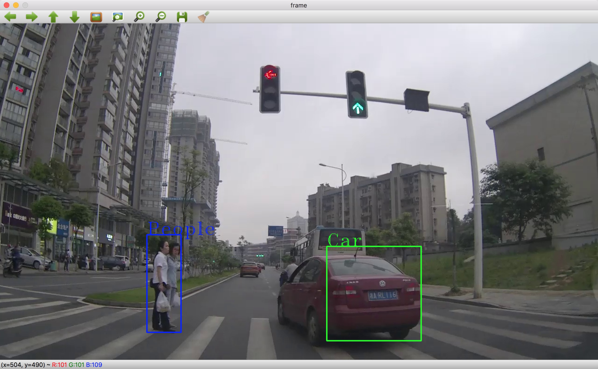
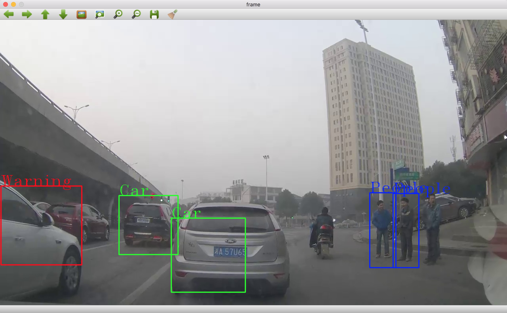

# [ADAS] Pedestrian and Vehicle Detection

This repo is my undergrad capstone project, which is a Vehicle & Pedestrian Detection system and is a part of a vision module for an Advanced Driver Assistance System (ADAS).

This system performed its car and pedestrian detection processes using a single camera mounted at the front of the car. The camera will return a video sequence which contains a sequence of images. By analyzing these images based on some detection/tracking algorithms, the system could an understanding of  surrounding environment.

This program has been tested on two platform: 

1. A PC, which has a 2.2 GHz Intel Core i5 CPU and 4G Memory, with Ubuntu 14.04 installed. On PC it takes 45.06ms to analyze a frame (1280 x 720 resolution) in average;
2. An Embedded platform, a ARM Cortex A9 (1GHz; single core) with Ubuntu 14.04 installed, it takes 588ms to analyze a frame (1280 x 720 resolution) in average.

In the second testbed (i.e., ARM Cortex A9), it is hard to say this program could be run in real-time. However, if we try to run this program on a ARM + GPU or ARM + FGPA platform, this kind of heterogeneous-architecture computation could boost the detection efficiency.

## Demo

Here are some demos of this program. 

*Note: Demo is performed on a Mac*


















## Overview

For the vehicle detection, I adopted a parallel-connected cascaded [Adaboost](https://en.wikipedia.org/wiki/AdaBoost) classifier, which contains two cascaded Ababoost classifiers with [Haar-like](https://en.wikipedia.org/wiki/Haar-like_feature) feature. One classifier is used for front-car detection, and the other one is used for rear-car detection. In the mean while, each cascaded Ababoost classifier is a series of Adaboost classifier which implemented in a group of decision stump in the low level.

For the pedestrian detection I adopted a Adaboost classifier with [LBP](https://en.wikipedia.org/wiki/Local_binary_patterns) feature and a [Support Vector Machine (SVM)](https://en.wikipedia.org/wiki/Support_vector_machine) with [HOG](https://en.wikipedia.org/wiki/Histogram_of_oriented_gradients) feature in series. Since the HOG feature is time-comsuming, the program runs Adaboost classifier first, and proposes some regions in which it thinks there is likely a pedestrian. Then the program runs SVM to double-check the regions proposed by the first classifier. Only when both of them say there is a pedestrian in that region, the program will be convinced.

For the detection of vehicles passing by on both side, the program utilized a [Optical Flow](https://en.wikipedia.org/wiki/Optical_flow) tracking algorithm. By calculating the optical flow on right-bottom region and left-bottom region, the program will know the relative speed of the moving objects on each side. Thereby, it can determine whether there is a vehicle passing by or not. In more detail, I implemented the Optical Flow tracking algorithm with a [SIFT](https://en.wikipedia.org/wiki/Scale-invariant_feature_transform) feature extractor and [Lucas-Kanade](https://en.wikipedia.org/wiki/Lucas–Kanade_method) method.


## How to run the program

### Pre-Compile

Before compiling, following dependencies should be pre-installed:

- Opencv
- pkg-config
- g++
- make

*After installing these tools, do not forget to link your Opencv lib to pkg-config. Since in my Makefile, I used pkg-config to generate Opencv compiler arguments.*

### Compile

Get into the `src` directory and type following command in your terminal,

```
make
```

*For more detail, please read the Makefile.*

### Run

**IMPORTANT: Read ME Please !!!**

In order to run this program, you have to provide your own **pre-trained model** which is a .xml file. And yes, you may have to change the source code in the file `vetdetectorstrategy.h`. The following lines could be changed to meet your demands,

```
#define HAAR_CASCADE_FRONT_CAR_XML "../data/haar-cascades/haar_cascade_front_car.xml"
#define HAAR_CASCADE_REAR_CAR_XML "../data/haar-cascades/haar_cascade_rear_car.xml"
#define HAAR_CASCADE_FULLBODY_XML "../data/haar-cascades/lbp_human.xml"
```

Just provide the path of your pre-trained model which is a .xml file. In this program, I utilized the [Opencv](https://www.opencv.org) library, therefore the .xml should follow the rules defined by Opencv, which also means you may have to use Opencv to train your model and export the model in a xml format by using some API provided by Opencv.

And Sorry, I **cannot** update my pre-trained model without permission from my supervisor, simply because he sponsored this project :). However, you do not really need to train your own model, because you can easily find other people's pre-trained model online, there are so many people use Opencv, just google it.


When the make process is done, you will get a executable file called `launch`, for the usage for this program, please try following command in your terminal

```
./launch --help
```

Your can also read the `demo.sh` and `demo_pedestrian.sh` to understand how to use it.

Here is another example which may help you get through,

```
./launch -c ../test_video.mov --pedestrian --vehicle --optflow
```

The command above means, the source video input is `../test_video.mov` (relative path or absolute path both is Okay), and enabled pedestrian, vehicle and optical flow detection.

******


**Zeyu Zhang @Hunan University, China**